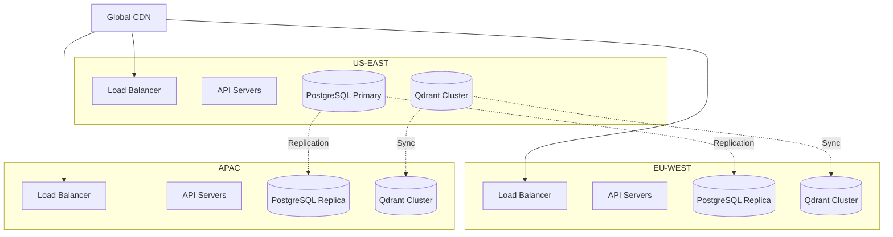

# Deployment Architecture

## 1. Kubernetes Deployment

```yaml
# Deployment Configuration
apiVersion: apps/v1
kind: Deployment
metadata:
  name: mcp-rag-server
spec:
  replicas: 3
  strategy:
    type: RollingUpdate
    rollingUpdate:
      maxSurge: 1
      maxUnavailable: 0
  template:
    spec:
      containers:
      - name: api-gateway
        image: mcp-rag/api:latest
        resources:
          requests:
            memory: "512Mi"
            cpu: "500m"
          limits:
            memory: "1Gi"
            cpu: "1000m"
        livenessProbe:
          httpGet:
            path: /health
            port: 8000
          initialDelaySeconds: 30
          periodSeconds: 10
        readinessProbe:
          httpGet:
            path: /ready
            port: 8000
          initialDelaySeconds: 5
          periodSeconds: 5
```

## 2. Edge Deployment for Mobile

```yaml
# CloudFlare Workers Configuration
edge_workers:
  - name: mobile-preprocessor
    routes:
      - pattern: /api/mobile/*
    script: |
      addEventListener('fetch', event => {
        event.respondWith(handleMobileRequest(event.request))
      })
      
      async function handleMobileRequest(request) {
        // Lightweight processing at edge
        const simplified = await simplifyForMobile(request)
        return fetch(origin, simplified)
      }
```

## 3. Multi-Region Architecture



---
