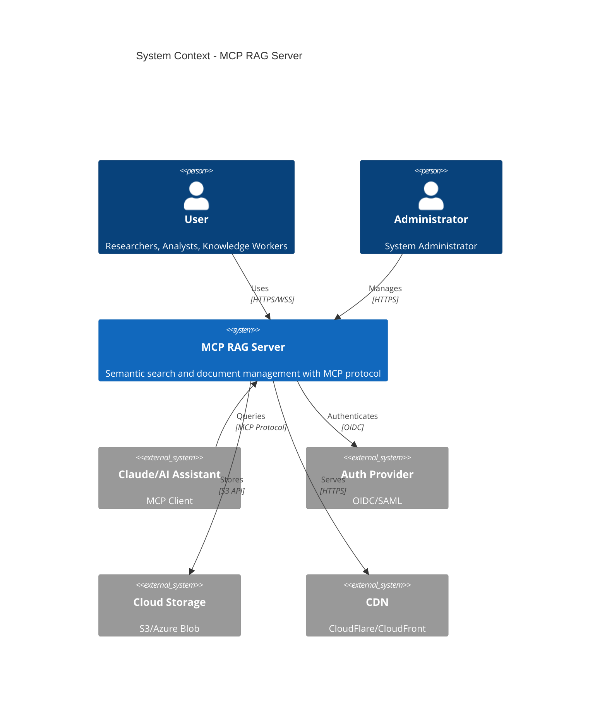
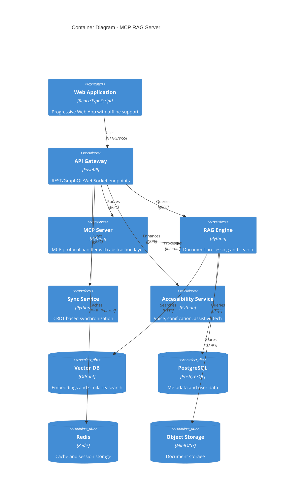

# High-Level Architecture

## System Boundaries

```mermaid
C4Context
    title System Context - MCP RAG Server
    
    Person(user, "User", "Researchers, Analysts, Knowledge Workers")
    Person(admin, "Administrator", "System Administrator")
    
    System(mcp_rag, "MCP RAG Server", "Semantic search and document management with MCP protocol")
    
    System_Ext(claude, "Claude/AI Assistant", "MCP Client")
    System_Ext(auth, "Auth Provider", "OIDC/SAML")
    System_Ext(storage, "Cloud Storage", "S3/Azure Blob")
    System_Ext(cdn, "CDN", "CloudFlare/CloudFront")
    
    Rel(user, mcp_rag, "Uses", "HTTPS/WSS")
    Rel(claude, mcp_rag, "Queries", "MCP Protocol")
    Rel(admin, mcp_rag, "Manages", "HTTPS")
    Rel(mcp_rag, auth, "Authenticates", "OIDC")
    Rel(mcp_rag, storage, "Stores", "S3 API")
    Rel(mcp_rag, cdn, "Serves", "HTTPS")
```

## Container Architecture

```mermaid
C4Container
    title Container Diagram - MCP RAG Server
    
    Container(web, "Web Application", "React/TypeScript", "Progressive Web App with offline support")
    Container(api, "API Gateway", "FastAPI", "REST/GraphQL/WebSocket endpoints")
    Container(mcp, "MCP Server", "Python", "MCP protocol handler with abstraction layer")
    Container(rag, "RAG Engine", "Python", "Document processing and search")
    Container(sync, "Sync Service", "Python", "CRDT-based synchronization")
    Container(access, "Accessibility Service", "Python", "Voice, sonification, assistive tech")
    
    ContainerDb(vector, "Vector DB", "Qdrant", "Embeddings and similarity search")
    ContainerDb(postgres, "PostgreSQL", "PostgreSQL", "Metadata and user data")
    ContainerDb(redis, "Redis", "Redis", "Cache and session storage")
    ContainerDb(s3, "Object Storage", "MinIO/S3", "Document storage")
    
    Rel(web, api, "Uses", "HTTPS/WSS")
    Rel(api, mcp, "Routes", "gRPC")
    Rel(api, rag, "Queries", "gRPC")
    Rel(api, sync, "Syncs", "gRPC")
    Rel(api, access, "Enhances", "gRPC")
    Rel(mcp, rag, "Processes", "Internal")
    Rel(rag, vector, "Searches", "HTTP")
    Rel(rag, postgres, "Queries", "SQL")
    Rel(api, redis, "Caches", "Redis Protocol")
    Rel(rag, s3, "Stores", "S3 API")
```

---
