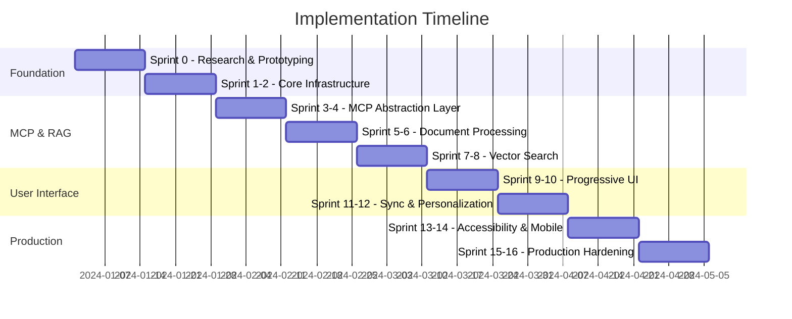

# MCP RAG Server Implementation Roadmap

## Executive Summary

This roadmap provides a 16-sprint (32-week) implementation plan for the MCP RAG Server, prioritizing risk mitigation, user research, and incremental delivery of value.

## Timeline Overview

---

## Sprint 0: Research & Prototyping (2 weeks)

### Objectives
- Validate technical assumptions
- Prototype critical risk areas
- Conduct initial user research

### Deliverables

| Story | Points | Priority | Owner |
|-------|--------|----------|--------|
| User research interviews (15-20 participants) | 8 | P0 | UX Team |
| MCP protocol abstraction proof-of-concept | 13 | P0 | Backend Team |
| CRDT synchronization prototype | 8 | P0 | Backend Team |
| Federated learning feasibility study | 5 | P1 | ML Team |
| Technology stack validation | 3 | P0 | Architect |

### Success Criteria
- [ ] User personas validated with research data
- [ ] MCP abstraction layer handles version switching
- [ ] CRDT prototype resolves basic conflicts
- [ ] Go/No-go decision on federated learning

---

## Sprint 1-2: Core Infrastructure (4 weeks)

### Sprint 1 Deliverables

| Story | Points | Priority | Description |
|-------|--------|----------|-------------|
| Docker environment setup | 5 | P0 | Multi-service Docker Compose |
| CI/CD pipeline | 8 | P0 | GitHub Actions with testing |
| PostgreSQL schema | 5 | P0 | Privacy-compliant database |
| Redis configuration | 3 | P0 | Caching and sessions |
| Monitoring setup | 5 | P1 | Prometheus + Grafana |

### Sprint 2 Deliverables

| Story | Points | Priority | Description |
|-------|--------|----------|-------------|
| Kubernetes manifests | 8 | P0 | Production deployment configs |
| Authentication service | 8 | P0 | OAuth 2.0/OIDC integration |
| Logging infrastructure | 5 | P0 | Structured logging with ELK |
| Development documentation | 3 | P0 | Setup guides and conventions |
| Security baseline | 5 | P0 | HTTPS, secrets management |

---

## Sprint 3-4: MCP Abstraction Layer (4 weeks)

### Sprint 3 Deliverables

| Story | Points | Priority | Description |
|-------|--------|----------|-------------|
| Hexagonal architecture setup | 8 | P0 | Domain model and ports |
| MCP v1.0 adapter | 13 | P0 | Initial protocol implementation |
| REST API fallback | 8 | P0 | Alternative to MCP |
| Protocol version detection | 5 | P0 | Auto-negotiation |

### Sprint 4 Deliverables

| Story | Points | Priority | Description |
|-------|--------|----------|-------------|
| MCP tool definitions | 5 | P0 | RAG operation tools |
| Protocol monitoring | 5 | P0 | Performance metrics |
| Integration tests | 8 | P0 | Protocol compliance |
| Error handling | 5 | P0 | Graceful degradation |
| Circuit breaker | 3 | P1 | Fault tolerance |

---

## Sprint 5-6: Document Processing Pipeline (4 weeks)

### Sprint 5 Deliverables

| Story | Points | Priority | Description |
|-------|--------|----------|-------------|
| PDF processor | 8 | P0 | PyPDF2 integration |
| Text extraction | 5 | P0 | Structure preservation |
| Metadata extraction | 5 | P0 | Author, date, etc. |
| Document storage | 5 | P0 | S3/MinIO integration |
| Processing queue | 8 | P0 | Celery with Redis |

### Sprint 6 Deliverables

| Story | Points | Priority | Description |
|-------|--------|----------|-------------|
| Intelligent chunking | 13 | P0 | Semantic boundaries |
| OCR integration | 8 | P1 | Scanned PDF support |
| Batch processing | 5 | P0 | Multiple documents |
| Progress tracking | 5 | P0 | Real-time updates |
| Error recovery | 3 | P0 | Partial failures |

---

## Sprint 7-8: Vector Search Implementation (4 weeks)

### Sprint 7 Deliverables

| Story | Points | Priority | Description |
|-------|--------|----------|-------------|
| Qdrant setup | 5 | P0 | Docker integration |
| Embedding service | 8 | P0 | Sentence-transformers |
| Vector indexing | 8 | P0 | Batch operations |
| Basic search | 8 | P0 | Similarity queries |
| Search API | 5 | P0 | REST endpoints |

### Sprint 8 Deliverables

| Story | Points | Priority | Description |
|-------|--------|----------|-------------|
| Hybrid search | 13 | P0 | Semantic + keyword |
| Query optimization | 8 | P0 | Performance tuning |
| Result ranking | 8 | P0 | Multi-factor scoring |
| Caching layer | 5 | P0 | Redis integration |
| Search analytics | 5 | P1 | Metrics collection |

---

## Sprint 9-10: Progressive User Interface (4 weeks)

### Sprint 9 Deliverables

| Story | Points | Priority | Description |
|-------|--------|----------|-------------|
| React app setup | 5 | P0 | Vite + TypeScript |
| Mantine integration | 5 | P0 | Design system |
| Search interface | 13 | P0 | Progressive disclosure |
| Document upload | 8 | P0 | Drag-and-drop |
| Result display | 8 | P0 | Cards with preview |

### Sprint 10 Deliverables

| Story | Points | Priority | Description |
|-------|--------|----------|-------------|
| Onboarding flow | 8 | P0 | First-time users |
| Visualization system | 13 | P0 | Smart recommendations |
| Real-time features | 8 | P0 | WebSocket integration |
| Dark theme | 3 | P1 | Mantine theming |
| Responsive design | 5 | P0 | Mobile layouts |

---

## Sprint 11-12: Sync & Personalization (4 weeks)

### Sprint 11 Deliverables

| Story | Points | Priority | Description |
|-------|--------|----------|-------------|
| CRDT implementation | 13 | P0 | Sync engine |
| Device management | 8 | P0 | Multi-device support |
| Conflict resolution | 8 | P0 | UI for conflicts |
| Offline support | 8 | P1 | Service workers |

### Sprint 12 Deliverables

| Story | Points | Priority | Description |
|-------|--------|----------|-------------|
| Federated learning | 13 | P1 | Privacy-preserving ML |
| Personalization UI | 8 | P0 | Preference controls |
| Learning analytics | 5 | P1 | User insights |
| Privacy controls | 8 | P0 | GDPR compliance |

---

## Sprint 13-14: Accessibility & Mobile (4 weeks)

### Sprint 13 Deliverables

| Story | Points | Priority | Description |
|-------|--------|----------|-------------|
| Accessibility audit | 5 | P0 | WCAG compliance |
| Screen reader support | 8 | P0 | ARIA labels |
| Keyboard navigation | 5 | P0 | Full support |
| Voice control | 13 | P1 | Accessibility service |
| High contrast | 3 | P0 | Theme variants |

### Sprint 14 Deliverables

| Story | Points | Priority | Description |
|-------|--------|----------|-------------|
| PWA setup | 8 | P0 | Service workers |
| Mobile optimization | 8 | P0 | Touch interfaces |
| Edge computing | 8 | P1 | CloudFlare workers |
| Offline mode | 5 | P1 | Cached documents |
| Cross-device handoff | 5 | P1 | Continuity |

---

## Sprint 15-16: Production Hardening (4 weeks)

### Sprint 15 Deliverables

| Story | Points | Priority | Description |
|-------|--------|----------|-------------|
| Performance testing | 8 | P0 | Load testing suite |
| Security audit | 8 | P0 | Penetration testing |
| Monitoring alerts | 5 | P0 | Alertmanager |
| Documentation | 5 | P0 | User and admin guides |
| Bug fixes | 8 | P0 | Critical issues |

### Sprint 16 Deliverables

| Story | Points | Priority | Description |
|-------|--------|----------|-------------|
| Production deployment | 8 | P0 | Multi-region setup |
| Backup procedures | 5 | P0 | Automated backups |
| Disaster recovery | 5 | P0 | DR testing |
| Performance optimization | 8 | P0 | Final tuning |
| Launch preparation | 5 | P0 | Go-live checklist |

---

## Risk Mitigation Checkpoints

### Sprint 2 Checkpoint
- [ ] MCP abstraction validated
- [ ] User research findings integrated
- [ ] Infrastructure stable

### Sprint 6 Checkpoint
- [ ] Document processing reliable
- [ ] Performance within budget
- [ ] User feedback positive

### Sprint 10 Checkpoint
- [ ] UI meets UX goals
- [ ] Search effectiveness validated
- [ ] Mobile experience acceptable

### Sprint 14 Checkpoint
- [ ] Accessibility compliance achieved
- [ ] Sync works reliably
- [ ] Privacy requirements met

---

## Team Structure

### Core Teams

| Team | Size | Responsibilities |
|------|------|------------------|
| Backend | 3 | MCP, RAG, APIs |
| Frontend | 2 | React UI, UX |
| ML/Data | 2 | Search, Embeddings |
| DevOps | 1 | Infrastructure |
| QA | 1 | Testing, Quality |
| UX | 1 | Research, Design |

### RACI Matrix

| Activity | Backend | Frontend | ML | DevOps | QA | UX |
|----------|---------|----------|-----|---------|-----|-----|
| MCP Abstraction | R | I | I | C | C | I |
| UI Development | I | R | I | C | C | A |
| Search Implementation | A | I | R | C | C | I |
| Infrastructure | C | C | C | R | I | I |
| User Research | I | C | I | I | I | R |

**R**: Responsible, **A**: Accountable, **C**: Consulted, **I**: Informed

---

## Success Metrics

### Technical Metrics
- Search latency P95 < 500ms
- Document processing < 5s per document
- System uptime > 99.9%
- Zero data breaches

### User Metrics
- Onboarding completion > 80%
- Search success rate > 85%
- User satisfaction > 4.2/5
- Mobile task completion > 90% of desktop

### Business Metrics
- 100 active users by Sprint 8
- 1000 active users by Sprint 16
- 10,000 documents indexed
- 50,000 searches performed

---

## Budget Allocation

| Category | Percentage | Sprint 0-8 | Sprint 9-16 |
|----------|------------|------------|-------------|
| Development | 60% | 70% | 50% |
| Infrastructure | 20% | 15% | 25% |
| Testing/QA | 10% | 5% | 15% |
| Documentation | 5% | 5% | 5% |
| Contingency | 5% | 5% | 5% |

---

## Communication Plan

### Sprint Ceremonies
- **Sprint Planning**: First Monday, 2 hours
- **Daily Standup**: 15 minutes, 10 AM
- **Sprint Review**: Last Friday, 1 hour
- **Retrospective**: Last Friday, 1 hour

### Stakeholder Updates
- **Weekly**: Email status report
- **Bi-weekly**: Demo session
- **Monthly**: Steering committee review

### Documentation
- **Confluence**: Technical documentation
- **GitHub Wiki**: Developer guides
- **Slack**: Daily communication

---

## Dependencies & Risks

### Critical Dependencies
1. MCP protocol stability (External)
2. Qdrant performance (Technical)
3. User research completion (Internal)
4. Security compliance approval (Legal)

### Risk Register

| Risk | Probability | Impact | Mitigation |
|------|-------------|---------|-----------|
| MCP breaking changes | High | High | Abstraction layer |
| Vector DB performance | Medium | High | Monitoring & scaling |
| Privacy compliance | Medium | Critical | Legal review early |
| Mobile limitations | High | Medium | Progressive enhancement |

---

## Definition of Done

### Story Level
- [ ] Code complete with tests
- [ ] Code reviewed and approved
- [ ] Documentation updated
- [ ] Deployed to staging
- [ ] Acceptance criteria met

### Sprint Level
- [ ] All stories complete
- [ ] Integration tests passing
- [ ] Performance benchmarks met
- [ ] Sprint demo prepared
- [ ] Retrospective completed

### Release Level
- [ ] Feature complete
- [ ] Security audit passed
- [ ] Performance validated
- [ ] Documentation complete
- [ ] Production deployed