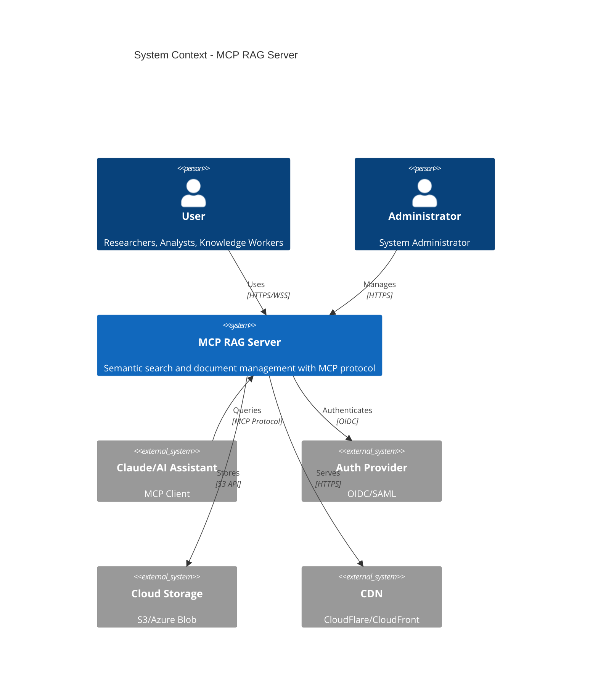
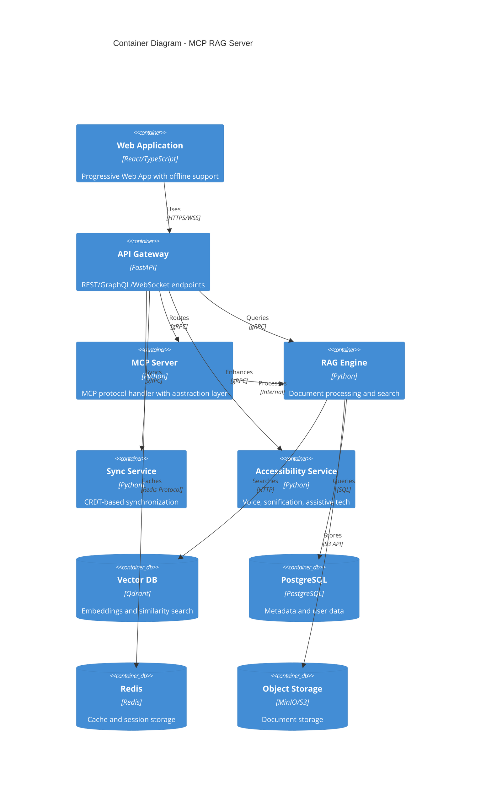
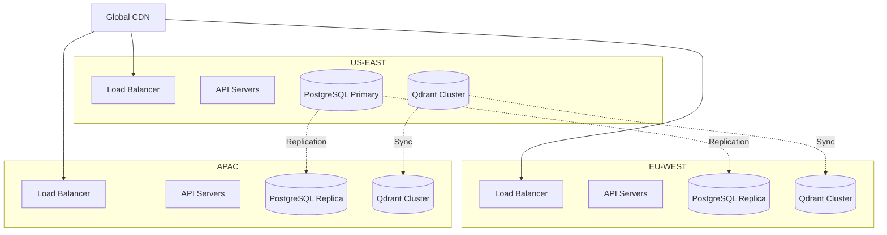

# MCP RAG Server Technical Architecture Document

## Executive Summary

This document provides the comprehensive technical architecture for the MCP RAG Server, incorporating all risk mitigations, user experience enhancements, and architectural patterns defined in the PRD. The architecture emphasizes protocol stability, privacy-by-design, cross-device synchronization, and progressive enhancement for accessibility and mobile features.

## Table of Contents

1. [System Overview](#system-overview)
2. [Architectural Principles](#architectural-principles)
3. [High-Level Architecture](#high-level-architecture)
4. [Core Components](#core-components)
5. [Data Architecture](#data-architecture)
6. [API Specifications](#api-specifications)
7. [Security Architecture](#security-architecture)
8. [Deployment Architecture](#deployment-architecture)
9. [Monitoring & Observability](#monitoring--observability)

---

## System Overview

### Architecture Style
The MCP RAG Server employs a **Hexagonal Architecture (Ports & Adapters)** pattern with **Domain-Driven Design** principles, ensuring:
- Protocol independence through abstraction layers
- Clear separation of business logic from infrastructure
- Testability and maintainability
- Flexibility for technology changes

### Key Architectural Decisions

| Decision | Rationale | Trade-off |
|----------|-----------|-----------|
| Hexagonal Architecture | MCP protocol instability requires abstraction | Additional complexity |
| CRDT for Synchronization | Automatic conflict resolution for multi-device | Learning curve, implementation complexity |
| Federated Learning | Privacy compliance while enabling personalization | Reduced model accuracy |
| Microservice for Accessibility | Performance isolation for complex features | Additional operational overhead |
| Edge Computing for Mobile | Overcome browser limitations | Infrastructure complexity |

---

## Architectural Principles

### 1. Protocol Agnosticism
- Core domain logic independent of MCP protocol
- Pluggable adapters for protocol versions
- Fallback mechanisms for protocol failures

### 2. Privacy-by-Design
- Data minimization at every layer
- Client-side processing when possible
- Encrypted data transmission and storage
- User consent at feature level

### 3. Progressive Enhancement
- Core functionality without JavaScript
- Advanced features as optional layers
- Graceful degradation for limited devices
- Accessibility as base requirement

### 4. Eventual Consistency
- CRDT-based conflict resolution
- Offline-first architecture
- Asynchronous synchronization
- Device-specific state isolation

---

## High-Level Architecture

### System Boundaries



### Container Architecture



---

## Core Components

### 1. MCP Protocol Abstraction Layer

```python
# Domain Model (Protocol Agnostic)
class RAGQuery:
    query: str
    filters: Dict[str, Any]
    limit: int
    threshold: float

# Port Interface
class RAGSearchPort(Protocol):
    async def search(self, query: RAGQuery) -> SearchResults:
        ...

# MCP Adapter (v1.0)
class MCPv1Adapter(RAGSearchPort):
    async def search(self, query: RAGQuery) -> SearchResults:
        # MCP v1.0 specific implementation
        ...

# REST Adapter (Fallback)
class RESTAdapter(RAGSearchPort):
    async def search(self, query: RAGQuery) -> SearchResults:
        # REST API implementation
        ...

# Protocol Manager
class ProtocolManager:
    def __init__(self):
        self.adapters = {
            'mcp_v1': MCPv1Adapter(),
            'rest': RESTAdapter()
        }
    
    async def execute(self, protocol: str, query: RAGQuery):
        adapter = self.adapters.get(protocol, self.adapters['rest'])
        return await adapter.search(query)
```

### 2. CRDT-Based Synchronization Engine

```python
# CRDT Data Structures
class LWWMap:  # Last-Write-Wins Map
    def __init__(self, node_id: str):
        self.node_id = node_id
        self.data: Dict[str, Tuple[Any, VectorClock]] = {}
    
    def set(self, key: str, value: Any, clock: VectorClock):
        if key not in self.data or clock > self.data[key][1]:
            self.data[key] = (value, clock)
    
    def merge(self, other: 'LWWMap'):
        for key, (value, clock) in other.data.items():
            self.set(key, value, clock)

# Sync Service
class SyncService:
    def __init__(self):
        self.local_state = LWWMap(node_id=device_id())
        self.vector_clock = VectorClock()
    
    async def sync_with_server(self):
        # Delta synchronization
        delta = self.get_changes_since(self.last_sync_clock)
        server_delta = await self.send_delta(delta)
        self.local_state.merge(server_delta)
        self.last_sync_clock = self.vector_clock.copy()
```

### 3. Federated Learning Privacy Engine

```python
# Privacy-Preserving Personalization
class FederatedLearningEngine:
    def __init__(self):
        self.local_model = PersonalizationModel()
        self.privacy_budget = PrivacyBudget(epsilon=1.0)
    
    async def train_local(self, user_interactions: List[Interaction]):
        # On-device training
        gradients = self.local_model.compute_gradients(user_interactions)
        
        # Add differential privacy noise
        noisy_gradients = self.privacy_budget.add_noise(gradients)
        
        # Homomorphic encryption for secure aggregation
        encrypted_gradients = homomorphic_encrypt(noisy_gradients)
        
        return encrypted_gradients
    
    async def update_global_model(self, encrypted_gradients):
        # Server-side secure aggregation without seeing individual updates
        aggregated = secure_aggregate(encrypted_gradients)
        self.global_model.apply_update(aggregated)
```

### 4. Document Processing Pipeline

```python
class DocumentProcessor:
    def __init__(self):
        self.extractors = {
            'pdf': PDFExtractor(),
            'docx': DocxExtractor(),
            'md': MarkdownExtractor()
        }
        self.chunker = IntelligentChunker()
        self.embedder = EmbeddingService()
    
    async def process_document(self, document: Document) -> ProcessedDocument:
        # Extract text with structure
        extracted = await self.extractors[document.type].extract(document)
        
        # Intelligent chunking
        chunks = await self.chunker.chunk(
            extracted,
            strategy='semantic',
            max_size=1000,
            overlap=200
        )
        
        # Generate embeddings
        embeddings = await self.embedder.embed_batch(chunks)
        
        return ProcessedDocument(
            chunks=chunks,
            embeddings=embeddings,
            metadata=extracted.metadata
        )
```

---

## Data Architecture

### 1. Vector Database Schema (Qdrant)

```json
{
  "collections": {
    "documents": {
      "vectors": {
        "size": 384,
        "distance": "Cosine"
      },
      "payload_schema": {
        "document_id": "keyword",
        "chunk_id": "keyword",
        "page_number": "integer",
        "chunk_type": "keyword",
        "content": "text",
        "metadata": "object"
      },
      "indexes": ["document_id", "chunk_type", "page_number"]
    }
  }
}
```

### 2. PostgreSQL Schema

```sql
-- User Management with Privacy
CREATE TABLE users (
    id UUID PRIMARY KEY DEFAULT gen_random_uuid(),
    email_hash VARCHAR(64) NOT NULL,  -- SHA-256 hash for privacy
    created_at TIMESTAMP WITH TIME ZONE DEFAULT NOW(),
    consent_flags JSONB NOT NULL DEFAULT '{}',
    deletion_requested BOOLEAN DEFAULT FALSE
);

-- Document Metadata
CREATE TABLE documents (
    id UUID PRIMARY KEY DEFAULT gen_random_uuid(),
    user_id UUID REFERENCES users(id) ON DELETE CASCADE,
    filename VARCHAR(255) NOT NULL,
    content_hash VARCHAR(64) NOT NULL,
    file_size BIGINT NOT NULL,
    doc_type VARCHAR(20) NOT NULL,
    processing_status VARCHAR(20) NOT NULL,
    metadata JSONB,
    created_at TIMESTAMP WITH TIME ZONE DEFAULT NOW(),
    updated_at TIMESTAMP WITH TIME ZONE DEFAULT NOW(),
    version INTEGER DEFAULT 1,
    UNIQUE(user_id, content_hash)
);

-- CRDT Sync State
CREATE TABLE sync_state (
    id UUID PRIMARY KEY DEFAULT gen_random_uuid(),
    user_id UUID REFERENCES users(id) ON DELETE CASCADE,
    device_id VARCHAR(64) NOT NULL,
    vector_clock JSONB NOT NULL,
    last_sync TIMESTAMP WITH TIME ZONE DEFAULT NOW(),
    state_snapshot JSONB,
    UNIQUE(user_id, device_id)
);

-- Search History (Privacy-Compliant)
CREATE TABLE search_history (
    id UUID PRIMARY KEY DEFAULT gen_random_uuid(),
    user_id UUID REFERENCES users(id) ON DELETE CASCADE,
    query_hash VARCHAR(64) NOT NULL,  -- Hashed for privacy
    query_intent VARCHAR(50),
    result_count INTEGER,
    click_through_rate FLOAT,
    created_at TIMESTAMP WITH TIME ZONE DEFAULT NOW(),
    expires_at TIMESTAMP WITH TIME ZONE  -- Auto-deletion for privacy
);
```

### 3. Redis Cache Structure

```python
# Cache Keys Structure
cache_keys = {
    # Search result caching
    "search:{query_hash}:{filters_hash}": "SearchResults (TTL: 1h)",
    
    # User session
    "session:{session_id}": "UserSession (TTL: 24h)",
    
    # Document processing status
    "processing:{document_id}": "ProcessingStatus (TTL: 1h)",
    
    # Rate limiting
    "rate_limit:{user_id}:{endpoint}": "RequestCount (TTL: 1min)",
    
    # Feature flags
    "features:{user_id}": "FeatureFlags (TTL: 5min)"
}
```

---

## API Specifications

### 1. MCP Protocol Tools

```yaml
# MCP Tool Definitions with Versioning
tools:
  rag_search:
    description: "Semantic search across documents"
    versions:
      v1.0:
        parameters:
          query: string
          limit: integer
          threshold: float
      v1.1:
        parameters:
          query: string
          limit: integer
          threshold: float
          filters: object
    fallback: REST API /api/v1/search

  rag_summarize:
    description: "Summarize documents"
    versions:
      v1.0:
        parameters:
          document_id: string
          summary_type: enum[executive, technical, bullets]
```

### 2. REST API Endpoints

```yaml
openapi: 3.0.0
paths:
  /api/v1/search:
    post:
      summary: "Semantic search with filters"
      requestBody:
        content:
          application/json:
            schema:
              type: object
              properties:
                query:
                  type: string
                filters:
                  type: object
                limit:
                  type: integer
                  default: 10
      responses:
        200:
          description: "Search results"
          content:
            application/json:
              schema:
                $ref: "#/components/schemas/SearchResults"

  /api/v1/documents:
    post:
      summary: "Upload document"
      requestBody:
        content:
          multipart/form-data:
            schema:
              type: object
              properties:
                file:
                  type: string
                  format: binary
                metadata:
                  type: object
```

### 3. WebSocket Events

```typescript
// WebSocket Event Definitions
interface WSEvents {
  // Client -> Server
  'search:start': {
    query: string;
    streaming: boolean;
  };
  
  // Server -> Client
  'search:result': {
    chunk: SearchResult;
    isLast: boolean;
  };
  
  'processing:progress': {
    documentId: string;
    stage: 'extracting' | 'chunking' | 'embedding';
    progress: number;
  };
  
  'sync:conflict': {
    field: string;
    localValue: any;
    remoteValue: any;
    resolution: 'local' | 'remote' | 'merge';
  };
}
```

---

## Security Architecture

### 1. Authentication & Authorization

```yaml
# OAuth 2.0 / OIDC Configuration
authentication:
  providers:
    - type: oidc
      issuer: https://auth.example.com
      client_id: ${OIDC_CLIENT_ID}
      client_secret: ${OIDC_CLIENT_SECRET}
      scopes: [openid, profile, email]
  
  jwt:
    algorithm: RS256
    public_key_path: /keys/jwt-public.pem
    access_token_ttl: 900  # 15 minutes
    refresh_token_ttl: 604800  # 7 days

# RBAC Configuration
authorization:
  roles:
    anonymous:
      permissions: [search:basic]
    user:
      permissions: [search:*, document:read, document:write]
    admin:
      permissions: ['*']
```

### 2. Data Encryption

```python
# Encryption at Rest and in Transit
class EncryptionService:
    def __init__(self):
        self.kms = KeyManagementService()
    
    async def encrypt_document(self, document: bytes) -> EncryptedDocument:
        # Generate data encryption key
        dek = self.kms.generate_data_key()
        
        # Encrypt document with DEK
        encrypted_content = aes_gcm_encrypt(document, dek.plaintext)
        
        # Return with encrypted DEK
        return EncryptedDocument(
            content=encrypted_content,
            encrypted_dek=dek.encrypted,
            key_id=dek.key_id
        )
```

### 3. Privacy Controls

```python
# Consent Management
class ConsentManager:
    async def check_consent(self, user_id: str, feature: str) -> bool:
        consent = await self.get_user_consent(user_id)
        return consent.has_granted(feature)
    
    async def apply_privacy_filters(self, data: Any, user_id: str) -> Any:
        consent = await self.get_user_consent(user_id)
        
        if not consent.analytics:
            data = remove_analytics_fields(data)
        
        if not consent.personalization:
            data = remove_personalization_fields(data)
        
        return data
```

---

## Deployment Architecture

### 1. Kubernetes Deployment

```yaml
# Deployment Configuration
apiVersion: apps/v1
kind: Deployment
metadata:
  name: mcp-rag-server
spec:
  replicas: 3
  strategy:
    type: RollingUpdate
    rollingUpdate:
      maxSurge: 1
      maxUnavailable: 0
  template:
    spec:
      containers:
      - name: api-gateway
        image: mcp-rag/api:latest
        resources:
          requests:
            memory: "512Mi"
            cpu: "500m"
          limits:
            memory: "1Gi"
            cpu: "1000m"
        livenessProbe:
          httpGet:
            path: /health
            port: 8000
          initialDelaySeconds: 30
          periodSeconds: 10
        readinessProbe:
          httpGet:
            path: /ready
            port: 8000
          initialDelaySeconds: 5
          periodSeconds: 5
```

### 2. Edge Deployment for Mobile

```yaml
# CloudFlare Workers Configuration
edge_workers:
  - name: mobile-preprocessor
    routes:
      - pattern: /api/mobile/*
    script: |
      addEventListener('fetch', event => {
        event.respondWith(handleMobileRequest(event.request))
      })
      
      async function handleMobileRequest(request) {
        // Lightweight processing at edge
        const simplified = await simplifyForMobile(request)
        return fetch(origin, simplified)
      }
```

### 3. Multi-Region Architecture



---

## Monitoring & Observability

### 1. Metrics Architecture

```yaml
# Prometheus Metrics
metrics:
  application:
    - mcp_protocol_requests_total
    - mcp_protocol_errors_total
    - mcp_protocol_latency_seconds
    - rag_search_latency_seconds
    - rag_search_results_count
    - document_processing_duration_seconds
    - embedding_generation_duration_seconds
    
  business:
    - user_search_success_rate
    - user_onboarding_completion_rate
    - document_upload_count
    - active_users_count
    
  infrastructure:
    - http_request_duration_seconds
    - database_connection_pool_size
    - cache_hit_rate
    - queue_depth
```

### 2. Distributed Tracing

```python
# OpenTelemetry Integration
from opentelemetry import trace

tracer = trace.get_tracer(__name__)

class RAGService:
    @tracer.start_as_current_span("rag.search")
    async def search(self, query: str) -> SearchResults:
        span = trace.get_current_span()
        span.set_attribute("query.length", len(query))
        
        with tracer.start_as_current_span("embedding.generate"):
            embedding = await self.generate_embedding(query)
        
        with tracer.start_as_current_span("vector.search"):
            results = await self.vector_search(embedding)
        
        span.set_attribute("results.count", len(results))
        return results
```

### 3. Logging Architecture

```python
# Structured Logging Configuration
import structlog

logger = structlog.get_logger()

# Privacy-compliant logging
logger = logger.bind(
    service="mcp-rag",
    environment=os.getenv("ENVIRONMENT"),
    version=os.getenv("VERSION")
)

# Log with privacy filtering
def log_search(query: str, user_id: str, results: int):
    logger.info(
        "search_performed",
        query_hash=hash_query(query),  # Hash for privacy
        user_id=hash_user_id(user_id),  # Hash for privacy
        result_count=results,
        timestamp=datetime.utcnow().isoformat()
    )
```

### 4. Alerting Rules

```yaml
# Alertmanager Configuration
groups:
  - name: mcp-rag-alerts
    rules:
      - alert: HighSearchLatency
        expr: histogram_quantile(0.95, rag_search_latency_seconds) > 2
        for: 5m
        annotations:
          summary: "Search latency P95 > 2 seconds"
          
      - alert: LowCacheHitRate
        expr: cache_hit_rate < 0.5
        for: 10m
        annotations:
          summary: "Cache hit rate below 50%"
          
      - alert: ProtocolVersionMismatch
        expr: mcp_protocol_version_mismatches > 10
        for: 5m
        annotations:
          summary: "High rate of MCP protocol version mismatches"
```

---

## Performance Budgets

### 1. Response Time Budgets

| Operation | P50 | P95 | P99 |
|-----------|-----|-----|-----|
| Search Query | 200ms | 500ms | 1s |
| Document Upload | 2s | 5s | 10s |
| Sync Operation | 100ms | 300ms | 500ms |
| UI Initial Load | 1s | 2s | 3s |

### 2. Resource Budgets

| Component | CPU | Memory | Storage |
|-----------|-----|---------|----------|
| API Gateway | 2 cores | 2GB | - |
| RAG Engine | 4 cores | 8GB | - |
| Vector DB | 8 cores | 16GB | 100GB SSD |
| PostgreSQL | 4 cores | 8GB | 50GB SSD |

---

## Disaster Recovery

### 1. Backup Strategy

```yaml
backup:
  databases:
    postgresql:
      frequency: daily
      retention: 30 days
      method: pg_dump with compression
      
    qdrant:
      frequency: daily
      retention: 7 days
      method: snapshot API
      
    redis:
      frequency: hourly
      retention: 24 hours
      method: RDB snapshot
  
  documents:
    storage: S3
    versioning: enabled
    lifecycle:
      - transition_to_glacier: 90 days
      - expiration: 365 days
```

### 2. Recovery Procedures

| Scenario | RTO | RPO | Procedure |
|----------|-----|-----|-----------|
| Database Failure | 1 hour | 1 hour | Restore from latest backup |
| Region Failure | 4 hours | 15 minutes | Failover to secondary region |
| Complete System Failure | 8 hours | 1 hour | Full restore from backups |

---

## Technology Stack Summary

### Backend
- **Language**: Python 3.11+
- **Frameworks**: FastAPI, Pydantic, SQLAlchemy
- **MCP SDK**: Anthropic MCP Python SDK
- **ML/AI**: Sentence-Transformers, LangChain, PyTorch
- **Document Processing**: PyPDF2, python-docx, markdown-it

### Frontend
- **Framework**: React 18+ with TypeScript
- **UI Library**: Mantine v7+
- **State Management**: Zustand with CRDT support
- **Build Tool**: Vite
- **PWA**: Workbox for service workers

### Data Storage
- **Vector Database**: Qdrant
- **Relational Database**: PostgreSQL 15+
- **Cache**: Redis 7+
- **Object Storage**: MinIO/S3

### Infrastructure
- **Container**: Docker, Kubernetes
- **Monitoring**: Prometheus, Grafana, Jaeger
- **Message Queue**: Redis Streams / Apache Kafka
- **API Gateway**: Kong / Traefik
- **CDN**: CloudFlare / AWS CloudFront

### Development
- **Version Control**: Git with GitFlow
- **CI/CD**: GitHub Actions
- **Testing**: Pytest, Jest, Playwright
- **Code Quality**: Black, ESLint, Prettier, mypy

---

## Conclusion

This technical architecture provides a robust, scalable, and privacy-compliant foundation for the MCP RAG Server. The architecture addresses all identified risks through:

1. **Protocol abstraction** for MCP evolution resilience
2. **CRDT-based synchronization** for conflict-free multi-device support
3. **Federated learning** for privacy-compliant personalization
4. **Progressive enhancement** for accessibility and mobile constraints
5. **Comprehensive monitoring** for performance and reliability

The modular design allows for independent scaling and evolution of components while maintaining system integrity and user experience quality.

## Appendices

### A. Database Migration Strategy
[Detailed migration procedures]

### B. API Rate Limiting Configuration
[Rate limit specifications per endpoint]

### C. Security Audit Checklist
[Comprehensive security verification steps]

### D. Performance Testing Scenarios
[Load testing configurations and benchmarks]